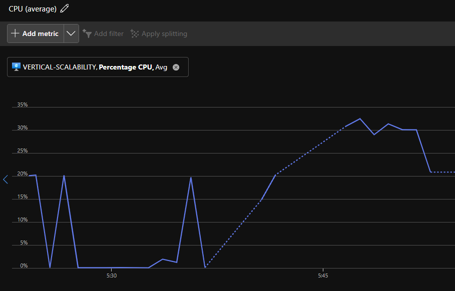
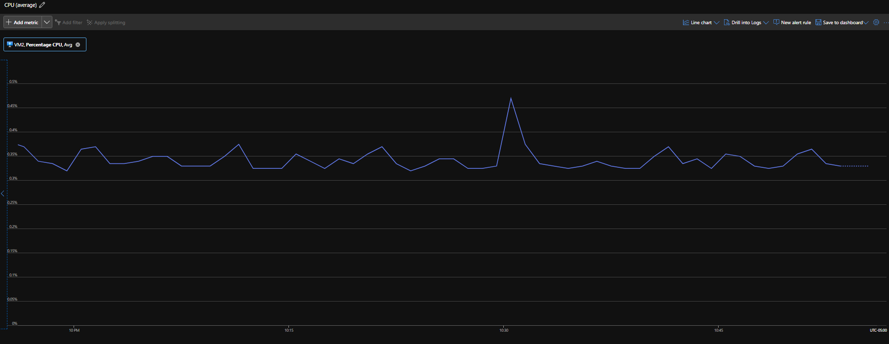

### Escuela Colombiana de Ingeniería
### Arquitecturas de Software - ARSW

### Jeisson Steban Casallas Rozo y David Leonardo Piñeros Cortes. 

## Escalamiento en Azure con Maquinas Virtuales, Sacale Sets y Service Plans

### Dependencias
* Cree una cuenta gratuita dentro de Azure. Para hacerlo puede guiarse de esta [documentación](https://azure.microsoft.com/es-es/free/students/). Al hacerlo usted contará con $100 USD para gastar durante 12 meses.

### Parte 0 - Entendiendo el escenario de calidad

Adjunto a este laboratorio usted podrá encontrar una aplicación totalmente desarrollada que tiene como objetivo calcular el enésimo valor de la secuencia de Fibonnaci.

**Escalabilidad**
Cuando un conjunto de usuarios consulta un enésimo número (superior a 1000000) de la secuencia de Fibonacci de forma concurrente y el sistema se encuentra bajo condiciones normales de operación, todas las peticiones deben ser respondidas y el consumo de CPU del sistema no puede superar el 70%.

### Parte 1 - Escalabilidad vertical

1. Diríjase a el [Portal de Azure](https://portal.azure.com/) y a continuación cree una maquina virtual con las características básicas descritas en la imágen 1 y que corresponden a las siguientes:
    * Resource Group = SCALABILITY_LAB
    * Virtual machine name = VERTICAL-SCALABILITY
    * Image = Ubuntu Server 
    * Size = Standard B1ls
    * Username = scalability_lab
    * SSH publi key = Su llave ssh publica


**SOLUCIÓN:** 


2. Para conectarse a la VM use el siguiente comando, donde las `x` las debe remplazar por la IP de su propia VM (Revise la sección "Connect" de la virtual machine creada para tener una guía más detallada).

    `ssh scalability_lab@xxx.xxx.xxx.xxx`


3. Instale node, para ello siga la sección *Installing Node.js and npm using NVM* que encontrará en este [enlace](https://linuxize.com/post/how-to-install-node-js-on-ubuntu-18.04/).

**SOLUCIÓN:** 


4. Para instalar la aplicación adjunta al Laboratorio, suba la carpeta `FibonacciApp` a un repositorio al cual tenga acceso y ejecute estos comandos dentro de la VM:

    `git clone <your_repo>`

    `cd <your_repo>/FibonacciApp`

    `npm install`


5. Para ejecutar la aplicación puede usar el comando `npm FibinacciApp.js`, sin embargo una vez pierda la conexión ssh la aplicación dejará de funcionar. Para evitar ese compartamiento usaremos *forever*. Ejecute los siguientes comando dentro de la VM.

    ` node FibonacciApp.js`


6. Antes de verificar si el endpoint funciona, en Azure vaya a la sección de *Networking* y cree una *Inbound port rule* tal como se muestra en la imágen. Para verificar que la aplicación funciona, use un browser y user el endpoint `http://xxx.xxx.xxx.xxx:3000/fibonacci/6`. La respuesta debe ser `The answer is 8`.


7. La función que calcula en enésimo número de la secuencia de Fibonacci está muy mal construido y consume bastante CPU para obtener la respuesta. Usando la consola del Browser documente los tiempos de respuesta para dicho endpoint usando los siguintes valores:
    * 1000000
    * 1010000
    * 1020000
    * 1030000
    * 1040000
    * 1050000
    * 1060000
    * 1070000
    * 1080000
    * 1090000    


8. Dírijase ahora a Azure y verifique el consumo de CPU para la VM. (Los resultados pueden tardar 5 minutos en aparecer).


9. Ahora usaremos Postman para simular una carga concurrente a nuestro sistema. Siga estos pasos.
    * Instale newman con el comando `npm install newman -g`. Para conocer más de Newman consulte el siguiente [enlace](https://learning.getpostman.com/docs/postman/collection-runs/command-line-integration-with-newman/).
    * Diríjase hasta la ruta `FibonacciApp/postman` en una maquina diferente a la VM.
    * Para el archivo `[ARSW_LOAD-BALANCING_AZURE].postman_environment.json` cambie el valor del parámetro `VM1` para que coincida con la IP de su VM.
    * Ejecute el siguiente comando.

    ```
    newman run ARSW_LOAD-BALANCING_AZURE.postman_collection.json -e [ARSW_LOAD-BALANCING_AZURE].postman_environment.json -n 10 &
    newman run ARSW_LOAD-BALANCING_AZURE.postman_collection.json -e [ARSW_LOAD-BALANCING_AZURE].postman_environment.json -n 10
    ```


10. La cantidad de CPU consumida es bastante grande y un conjunto considerable de peticiones concurrentes pueden hacer fallar nuestro servicio. Para solucionarlo usaremos una estrategia de Escalamiento Vertical. En Azure diríjase a la sección *size* y a continuación seleccione el tamaño `B2ms`.


11. Una vez el cambio se vea reflejado, repita el paso 7, 8 y 9.
12. Evalue el escenario de calidad asociado al requerimiento no funcional de escalabilidad y concluya si usando este modelo de escalabilidad logramos cumplirlo.





13. Vuelva a dejar la VM en el tamaño inicial para evitar cobros adicionales.

**Preguntas**

1. ¿Cuántos y cuáles recursos crea Azure junto con la VM?

**Rta/:** Al crear una VM en azure, nos proporciona el entorno de la aplicación, el disco de almacenamiento, la red virtual, grupo de seguridad de red, la dirección IP publica, interfaz la Red.

2. ¿Brevemente describa para qué sirve cada recurso?

**Rta/:** 
**VM:** Ejecuta el sistema operativo y las aplicaciones.
**Disco de almacenamiento:** Almacena archivos del sistema y datos persistentes.
**VNet:** Configura una red aislada para la VM.
**Seguridad de red:** Controla acceso de red según reglas configuradas.
**IP publica:** Proporciona acceso externo.
**NIC:**  Permite que la VM se comunique con otros dispositivos en la red.

3. ¿Al cerrar la conexión ssh con la VM, por qué se cae la aplicación que ejecutamos con el comando `npm FibonacciApp.js`? ¿Por qué debemos crear un *Inbound port rule* antes de acceder al servicio?

**Rta/:** El comando npm FibonacciApp.js inicia un proceso que depende de una conexión activa para seguir funcionando; si esta se cierra, la aplicación también se detiene.
Es necesario crear una regla de puerto de entrada (Inbound port rule) para habilitar el tráfico hacia el puerto 3000, ya que, de manera predeterminada, Azure bloquea el acceso de entrada a todos los puertos. Esta configuración es necesaria para el correcto funcionamiento de la aplicación en la VM.

4. Adjunte tabla de tiempos e interprete por qué la función tarda tando tiempo.

**Rta/:**
Antes del escalmiento:


Despues del escalamiento:


La función de Fibonacci tarda mucho porque aumenta exponencialmente en complejidad (O(2^n)), especialmente sin la optimización de los tiempos del calculo.

5. Adjunte imágen del consumo de CPU de la VM e interprete por qué la función consume esa cantidad de CPU.

**Rta/:**

Antes del escalamiento:


Despues del escalamiento:


La imagen del consumo de CPU muestra una alta carga durante la ejecución de Fibonacci, lo cual es esperable dado que el cálculo consume recursos intensivamente, sobre todo si no está optimizado.

6. Adjunte la imagen del resumen de la ejecución de Postman. Interprete:
    * Tiempos de ejecución de cada petición.
    * Si hubo fallos documentelos y explique.

**Rta/:**

Antes del escalamiento:


Despues del escalamiento:


Podemos ver que los tiempos de ejecución no variaron tanto, antes del escalamiento vertical, como despues de este, su variación se dio de  aproximadamente 10 segundos. En cuanto a fallos no se presento ninguno durante la ejecución de Postman.

7. ¿Cuál es la diferencia entre los tamaños `B2ms` y `B1ls` (no solo busque especificaciones de infraestructura)?

**Rta/:**

**B2ms:** tiene más CPU y memoria, soporta cargas más altas y es apto para aplicaciones intensivas.
**B1ls:** es más básico, con menos capacidad de procesamiento y memoria, adecuado para cargas de trabajo de baja intensidad.

8. ¿Aumentar el tamaño de la VM es una buena solución en este escenario?, ¿Qué pasa con la FibonacciApp cuando cambiamos el tamaño de la VM?

**Rta/:** Esto va a funcionar como una solución temporal, donde va a mejorar el rendimiento de la aplicación, sin embargo, si el flujo de peticiones aumenta de nuevo, vamos a volver a tener el mismo problema que se nos presentaba anteriormente en cuanto a consumo de CPU.
Cambiar el tamaño implica un reinicio de la VM, lo que puede afectar la disponibilidad.

9. ¿Qué pasa con la infraestructura cuando cambia el tamaño de la VM? ¿Qué efectos negativos implica?

**Rta/:** Se debe reiniciar la maquina por lo que se pierde la conexión SSH y la aplicación deja de estar disponible debido a que debe reasignar recursos.

10. ¿Hubo mejora en el consumo de CPU o en los tiempos de respuesta? Si/No ¿Por qué?

**Rta/:** Si se noto una mejoria, debido a que al cambiar el tamaño, se aumenta la cantidad de CPU y memoria RAM, por lo que la aplicación puede procesar mas peticiones en un menor tiempo.

11. Aumente la cantidad de ejecuciones paralelas del comando de postman a `4`. ¿El comportamiento del sistema es porcentualmente mejor?

**Rta/:** 


No podemos evidenciar una mejoria en el comportamiento del sistema en este caso.

### Parte 2 - Escalabilidad horizontal

#### Crear el Balanceador de Carga

Antes de continuar puede eliminar el grupo de recursos anterior para evitar gastos adicionales y realizar la actividad en un grupo de recursos totalmente limpio.

1. El Balanceador de Carga es un recurso fundamental para habilitar la escalabilidad horizontal de nuestro sistema, por eso en este paso cree un balanceador de carga dentro de Azure tal cual como se muestra en la imágen adjunta.


2. A continuación cree un *Backend Pool*, guiese con la siguiente imágen.


3. A continuación cree un *Health Probe*, guiese con la siguiente imágen.


4. A continuación cree un *Load Balancing Rule*, guiese con la siguiente imágen.


5. Cree una *Virtual Network* dentro del grupo de recursos, guiese con la siguiente imágen.


#### Crear las maquinas virtuales (Nodos)

Ahora vamos a crear 3 VMs (VM1, VM2 y VM3) con direcciones IP públicas standar en 3 diferentes zonas de disponibilidad. Después las agregaremos al balanceador de carga.

1. En la configuración básica de la VM guíese por la siguiente imágen. Es importante que se fije en la "Avaiability Zone", donde la VM1 será 1, la VM2 será 2 y la VM3 será 3.


No es posible agreagar una tercera maquina debido al limite de recursos de la subscripción de estudiante, por lo que se realizo con dos.

2. En la configuración de networking, verifique que se ha seleccionado la *Virtual Network*  y la *Subnet* creadas anteriormente. Adicionalmente asigne una IP pública y no olvide habilitar la redundancia de zona.


3. Para el Network Security Group seleccione "avanzado" y realice la siguiente configuración. No olvide crear un *Inbound Rule*, en el cual habilite el tráfico por el puerto 3000. Cuando cree la VM2 y la VM3, no necesita volver a crear el *Network Security Group*, sino que puede seleccionar el anteriormente creado.


4. Ahora asignaremos esta VM a nuestro balanceador de carga, para ello siga la configuración de la siguiente imágen.


5. Finalmente debemos instalar la aplicación de Fibonacci en la VM. para ello puede ejecutar el conjunto de los siguientes comandos, cambiando el nombre de la VM por el correcto

```
git clone https://github.com/daprieto1/ARSW_LOAD-BALANCING_AZURE.git

curl -o- https://raw.githubusercontent.com/creationix/nvm/v0.34.0/install.sh | bash
source /home/vm1/.bashrc
nvm install node

cd ARSW_LOAD-BALANCING_AZURE/FibonacciApp
npm install

npm install forever -g
forever start FibonacciApp.js
```

Realice este proceso para las 3 VMs, por ahora lo haremos a mano una por una, sin embargo es importante que usted sepa que existen herramientas para aumatizar este proceso, entre ellas encontramos Azure Resource Manager, OsDisk Images, Terraform con Vagrant y Paker, Puppet, Ansible entre otras.


#### Probar el resultado final de nuestra infraestructura

1. Porsupuesto el endpoint de acceso a nuestro sistema será la IP pública del balanceador de carga, primero verifiquemos que los servicios básicos están funcionando, consuma los siguientes recursos:

```
http://52.155.223.248/
http://52.155.223.248/fibonacci/1
```


2. Realice las pruebas de carga con `newman` que se realizaron en la parte 1 y haga un informe comparativo donde contraste: tiempos de respuesta, cantidad de peticiones respondidas con éxito, costos de las 2 infraestrucruras, es decir, la que desarrollamos con balanceo de carga horizontal y la que se hizo con una maquina virtual escalada.

El rendimiento de las máquinas virtuales con el balanceo de carga es mejor que el rendimiento de las máquinas virtuales con escalamiento vertical, ya que las máquinas virtuales con el balanceo de carga procesan más peticiones en menos tiempo.




Al revisar los tiempos de ejecución obtenidos entre el balaencio de carga y el escalamiento vertical podemos ver que los tiempos de ejecución disminuyen considerablemente a pesar de solo tener dos maquinas virtuales, ademas de que el uso de CPU tambien debido a que distribuye las peticiones, por lo que llegamos a que es mas eficiente.


3. Agregue una 4 maquina virtual y realice las pruebas de newman, pero esta vez no lance 2 peticiones en paralelo, sino que incrementelo a 4. Haga un informe donde presente el comportamiento de la CPU de las 4 VM y explique porque la tasa de éxito de las peticiones aumento con este estilo de escalabilidad.

```
newman run ARSW_LOAD-BALANCING_AZURE.postman_collection.json -e [ARSW_LOAD-BALANCING_AZURE].postman_environment.json -n 10 &
newman run ARSW_LOAD-BALANCING_AZURE.postman_collection.json -e [ARSW_LOAD-BALANCING_AZURE].postman_environment.json -n 10 &
newman run ARSW_LOAD-BALANCING_AZURE.postman_collection.json -e [ARSW_LOAD-BALANCING_AZURE].postman_environment.json -n 10 &
newman run ARSW_LOAD-BALANCING_AZURE.postman_collection.json -e [ARSW_LOAD-BALANCING_AZURE].postman_environment.json -n 10
```
No es posible agreagr una cuarta maquina debido al limite de recursos de la subscripción de estudiante.

**Preguntas**

* ¿Cuáles son los tipos de balanceadores de carga en Azure y en qué se diferencian?, ¿Qué es SKU, qué tipos hay y en qué se diferencian?, ¿Por qué el balanceador de carga necesita una IP pública?

**RTA:**

**Tipos de Balanceadores de Carga en Azure**

**El Balanceador Público** distribuye el tráfico desde internet hacia las instancias de servicio en la red de Azure.
**El Balanceador Privado** gestiona el tráfico dentro de la red privada, sin exposición directa a internet.

La principal diferencia radica en la accesibilidad; el balanceador público tiene una IP pública que permite el acceso desde fuera de Azure, mientras que el balanceador privado se usa solo para tráfico interno en la red virtual.

**SKU (Stock Keeping Unit)**

SKU en Azure representa una "unidad de mantenimiento de existencias", un identificador de versión para los recursos que indica características y capacidades.

**Básico:** Para necesidades de balanceo de carga de baja complejidad; ofrece menos configuraciones y soporte limitado para funciones avanzadas.
**Estándar:** Ofrece mayor control, seguridad, escalabilidad y compatibilidad con la mayoría de las funciones avanzadas de Azure.

La diferencia radica en que la SKU estándar admite más funciones de seguridad, mayor escala y rendimiento, y tiene costos más altos en comparación con la básica.

**Necesidad de una IP Pública para el Balanceador de Carga**

El balanceador de carga necesita una IP pública para distribuir tráfico de red desde internet a los recursos internos en Azure. Sin esta IP, el balanceador no podría enrutar el tráfico externo a la red de Azure.

* ¿Cuál es el propósito del *Backend Pool*?

**RTA:**

El objetivo del backend pool es proporcionar un grupo de recursos que se puedan asignar a las solicitudes de los usuarios. Esto se utiliza para escalar el rendimiento de una aplicación web o API, de forma que se pueda mejorar la disponibilidad de la aplicación y que esta escale de forma automatica para satisfacer una cierta demanda de usuarios.

* ¿Cuál es el propósito del *Health Probe*?

**RTA:**

Tal como su nombre lo dice, esta nos ayuda a determinar el estado de salud de un servicio. Esto se utiliza mayormente para sistemas distribuidos garantizando que esten disponibles y funcionando correctamente por medio de verificaciones que realiza en base a las respuestas obtenidas del backend donde valida que cumpla con los criterios establecidos, esto con el fin de mejorar la escalibilidad dinamica y optimizar el rendimiento del sistema.

* ¿Cuál es el propósito de la *Load Balancing Rule*? ¿Qué tipos de sesión persistente existen, por qué esto es importante y cómo puede afectar la escalabilidad del sistema?.

**RTA:**
a Load Balancing Rule define cómo se distribuye el tráfico entre las instancias del Backend Pool, especificando los puertos de entrada y salida, así como el protocolo. Esto permite controlar el flujo de tráfico.

**Tipos de sesión persistente**
Sesión basada en IP (Hash de IP): 
Sesión basada en puerto (Hash de 5-tuplas)

La persistencia de sesión es crucial para aplicaciones que dependen del estado de la conexión, sin embargo, La sesión persistente puede limitar la flexibilidad para distribuir tráfico de manera uniforme, afectando la capacidad de escalado.


* ¿Qué es una *Virtual Network*? ¿Qué es una *Subnet*? ¿Para qué sirven los *address space* y *address range*?

**RTA:**

**Virtual Network (VNet):** Es una red lógica en Azure que permite la comunicación entre recursos de la misma red.
**Subnet:** Una subdivisión de la VNet que permite organizar y aislar los recursos dentro de la misma red virtual.

**Address Space y Address** Range definen los rangos de IP dentro de la VNet y sus subredes, permitiendo controlar la asignación de IP y evitar conflictos.

* ¿Qué son las *Availability Zone* y por qué seleccionamos 3 diferentes zonas?. ¿Qué significa que una IP sea *zone-redundant*?

**RTA:**

Las Availability Zones son zonas físicas aisladas dentro de una región de Azure, cada una con su propia infraestructura.

Seleccionar múltiples zonas permite alta disponibilidad y redundancia en caso de fallos de hardware o energía en una zona específica.

La Zone-Redundant IP es una IP que funciona de forma redundante entre múltiples zonas, manteniendo conectividad incluso si una zona falla.

* ¿Cuál es el propósito del *Network Security Group*?

**RTA:**
El NSG es un firewall que controla el tráfico de red hacia y desde los recursos de Azure en una red virtual, utilizando reglas de entrada y salida para definir qué tráfico se permite o bloquea.

* Informe de newman 1 (Punto 2)

* Presente el Diagrama de Despliegue de la solución.

**RTA:**


